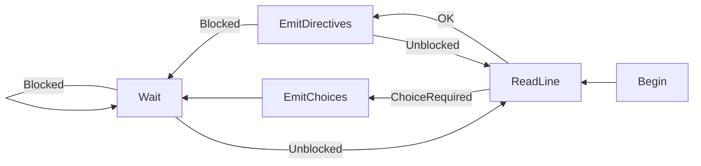

# Scripting behavior

There isn't much done yet, but I'm writing this to help understand what little is here.

The story script is written in Ink, and the text emitted by ink should follow this structure:

```
Willow: A directive is a colon-separated pair of a verb and a body.
Verb: Body
Willow: Each line can contain one or more directives, separated by a double-semicolon.
First: Directive;; Second: Directive
Willow: Double-semicolon-joined directives will always execute on the same frame, *even if one or more of them blocks!* You can use a double-semicolon-glue like this ;;<>
Willow: to split them across multiple lines in Ink for organization. This is useful for setting up scenes, having characters make remarks or emote midsentence, or for having multiple characters move at once.
```

The inkleton maintains a counter of blockers, and will only advance when this counter is zero. It increments this counter itself when choices are available, but anything that needs to stop the story from progressing can increment or decrement this counter.

At runtime, the "Inkleton" (Ink singleton) follows this general algorithm:


## Available directives

No directives are available yet, but these are planned.

* `Stage: StageName` loads a new stage, if it isn't the current stage already.
* `Enters: Actor [Entrance]` causes an actor to enter the scene. The actor will pick an entrance automatically if we know the room where we saw them last, otherwise they will appear at `Entrance`. If they walk as part of appearing through an entrance, this will block until they finish.
* `Appears: Actor Landmark` causes an actor to appear at a landmark. This will teleport them if necessary, and is mostly useful when setting up a scene.
* `Controls: yes|no` turns controls on and off.
* `Moves: Actor Landmark` causes an actor to move to a landmark, and blocks until they finish.
* `Act: Actor Animation` causes an actor to play a special animation. If and how long this blocks depends on the animation.
* `Camera: relax|focus|care|static [target]`
  * `relax` resets the camera to the map's own logic.
  * `focus` causes the camera to exactly follow an actor.
  * `care` causes the camera to care about an actor, keeping it in frame in addition to the player.
  * `static` causes the camera to take a particular position.
* `Title: Body` causes a title card to appear.
* `[ActorName]: Body` causes an actor to say something.
* `Thought: Body` causes an ambiguous thought/whisper effect to appear.
* `Comment: Body` does nothing.